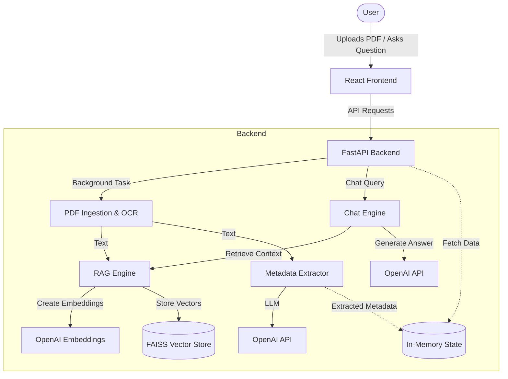

# AI Contract Chatbot for IT Admin Team

A PDF-based chatbot that reads contracts, extracts metadata, and answers questions using RAG (Retrieval-Augmented Generation) without persistent database storage.

## Features

- **PDF Ingestion**: Upload multiple PDF contracts (digital or scanned/OCR).
- **Metadata Extraction**: Automatically extracts Title, Vendor, Dates, and Renewal Terms.
- **Chat Interface**: React-based UI to ask natural language questions about the contracts.
- **No Database**: All processing is in-memory for security and simplicity.
- **MCP Integration**: Exposes contract querying as an MCP tool.

## Architecture

- **Backend**: FastAPI (Python)
- **Frontend**: React (JS)
- **RAG Engine**: LangChain + FAISS + OpenAI

### Architecture Diagram



## Functional Details

### Frontend (React)
- **Sidebar**: Displays a list of uploaded contracts along with their extracted metadata (e.g., Title, Vendor, Effective Date) retrieved from the backend state.
- **File Uploader**: Allows users to select one or multiple PDF files. It maintains a list of selected files locally before triggering sequential upload requests to the backend.
- **Chat Interface**: Provides a natural language interface for users to ask questions about either all uploaded documents or a specific, selected document. It displays the AI's response along with the sources (filenames) used to generate the answer.

### Backend (FastAPI)
- **File Upload & Background Processing**: Accepts PDF uploads and immediately returns a processing status while queuing the actual extraction and indexing as background tasks to prevent blocking the main event loop.
- **In-Memory State (`AppState`)**: Stores active processing tasks, metadata for processed files, and holds instances of the RAG and Chat engines. It acts as the ephemeral database for the application.
- **Mock Mode Fallback**: If an invalid or no OpenAI API key is provided at startup, the server automatically initializes with `FakeEmbeddings` and a `FakeListChatModel`. This ensures the UI remains functional for demonstration, returning canned responses instead of crashing.

### Document Processing & RAG Engine
- **Text Extraction**: Uses `pypdf` for standard text extraction and falls back to `pytesseract` and `pdf2image` for OCR if the PDF is image-based.
- **Metadata Extraction**: Uses an LLM (via LangChain structured output) to extract key contract fields (Title, Vendor, Dates, etc.) from the raw text.
- **Vector Search (FAISS)**: The extracted text is chunked and embedded using OpenAI. The FAISS vector store associates each document chunk with its source filename and `contract_id` in metadata, allowing the chat engine to filter context by a specific document when requested.

## Folder Structure

```
project/
├── api/                # FastAPI backend endpoints
├── frontend/           # React frontend application
├── ingestion/          # PDF loading and text extraction
├── contract_parser/    # Text cleaning
├── metadata_extractor/ # LLM-based metadata extraction
├── rag_engine/         # Vector store and retrieval (FAISS)
├── chat_engine/        # Q&A logic
├── utils/              # Logging and helpers
├── config/             # Configuration settings
├── tests/              # Unit tests
└── main.py             # Entry point
```

## Setup

### 1. Backend Setup

1. **Prerequisites**:
   - Python 3.10+
   - Tesseract OCR (optional, for scanned PDFs): `sudo apt-get install tesseract-ocr`
   - Poppler (for PDF-to-image conversion): `sudo apt-get install poppler-utils`

2. **Installation**:
   ```bash
   pip install -r requirements.txt
   ```

3. **Configuration**:
   - Copy `.env.example` to `.env` (or set environment variables).
   - Set `OPENAI_API_KEY`.

4. **Run Server**:
   ```bash
   python main.py server
   ```
   The API runs on `http://localhost:8000`. API Docs at `http://localhost:8000/docs`.

### 2. Frontend Setup

1. **Navigate to frontend**:
   ```bash
   cd frontend
   ```

2. **Install Dependencies**:
   ```bash
   npm install
   ```

3. **Run UI**:
   ```bash
   npm start
   ```
   The app runs on `http://localhost:3000`. It proxies API requests to port 8000.

### 3. MCP Server (Optional)
```bash
python main.py mcp
```

## Testing

Run unit tests:
```bash
python -m unittest discover tests
```
